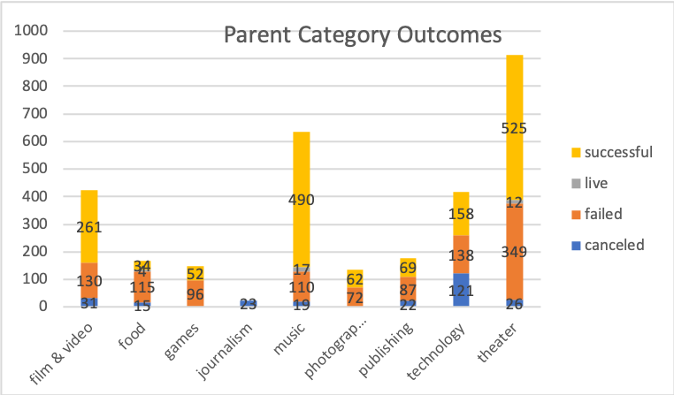
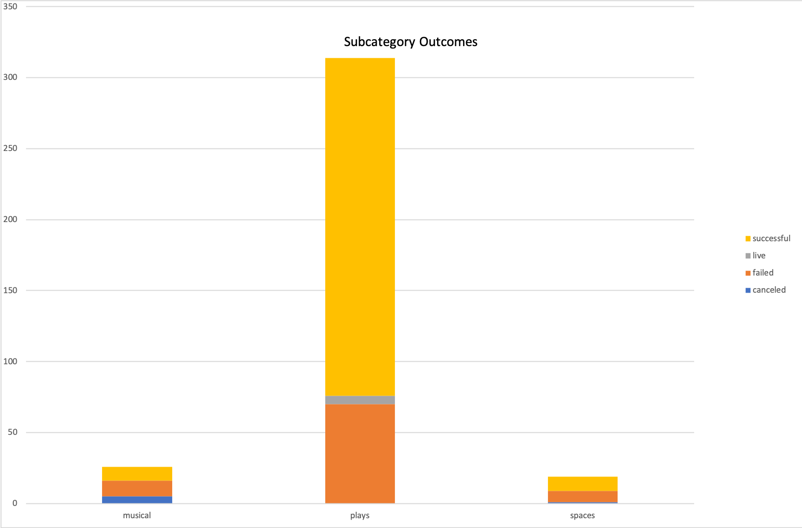
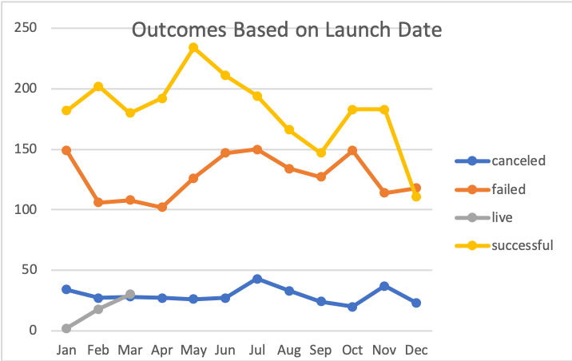
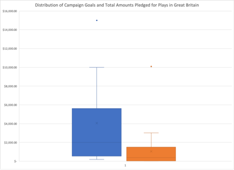
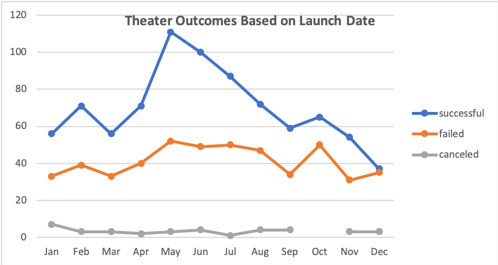
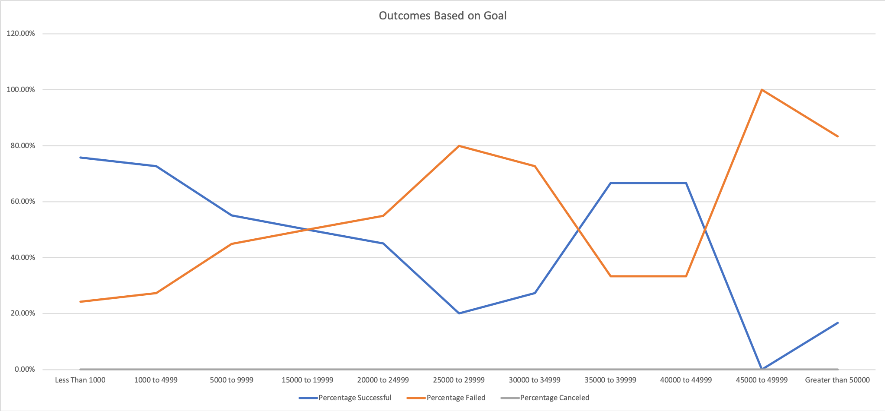

# Kickstarting with Excel
## Overview of Project
* This project explores the various trends in project campaigns to help a friend, Louise, establish her campaign strategy. The Kickstarter data was organized and sorted, and visualizations were created to strengthen the analysis. 
### Purpose
* The purpose of this project is to analyze crowdfunding data to help determine trends in project campaigns using Excel. Specifically, comparing the outcomes of different theater campaigns based on their launch dates and their funding goals through summary tables, charts, and graphs.  
* Louise's play came close to its fundraising goal in a short amont of time so visualizing campaign oucomes based on lauch dates and funding goals is beneficial to ensure success.
## Analysis and Challenges
* First, the data was filtered so we could focus on the projects that had a similar monetary goal as Louis of $12,000. Conditional formatting was then used to organize the outcomes column of the Kickstarter campaigns in the data: cells that denoted a successful campaign were colored green and those that represented failed campaigns were colored red. This makes it easier for Louise to interpret the data.
* The deficit between the fundraising goal and the amount pledged was then calculated using Excel's ROUND formula to measure how much of each campaign's goal was actually met. We made a new column in the data for easier visualization. Then, how close each campaign came to reaching or even exceeding the funding goal could be rapidly determined. It seemed many campaigns only barely missed their goal amount.
* In order to help Louise organize her incentives, it would be useful to see how much money people pledge to campaigns in the past. Using the ROUND formula again with the Pledged column data, we just slightly modified it to specify 2 digits after the decimal rather than a whole number so we could see the percentage.   
* The new column created had errors that had to be dubugged. While all campaigns had a fundraising goal not every campaign has backers. Since there is no number to dived by in the formula, an error occurs that should be cleaned up. We nested the =IFERROR(value,value_if_error) formula and the ROUND formula so we get a zero-value input. Next, filters were applied on the cells to only include the Theater category because Louise is just interested in the theater campaigns. 
* While Louise is focused on theater campaigns, it is still beneficial to look at the outcomes of all the categories for additional insight.
* The Kickstarter data was broken down further by separating the "Category and Subcategory" into 2 separate columns: "Parent Category" and "Subcategory." 

* The Pivot graph shown below were created to help Louise uncover trends in the data for the parent categories. 

* In the US, theater campaigns had the most successful campaigns at 525. However, music campaigns had the highest success rate at 77%. Theater, music, film and video, and technology all had more successful campaigns than failed, while food, games, photography, and publishing had more failed than successful. Interestingly enough, journalism had no successful campaigns at all. It looks like Louise chose a good category for funding a campaign. 

* Another pivot graph was created to illustrate the trends of theatrical productions in Great Britain as it is more relevant for Louise.

* In Great Britain, theatrical plays are the most successful subcategory. Out of all 258 successful theater campaigns, 238 of them were plays. Thus, we can conclude that theather fundraising campaigns, specifically plays, are the most successful.

* A pivot chart was generated to help Louise determine if the the length of a campaign correlates with its success. Then, a line chart with the same data was created since Louise is looking at trends over time. 

* The months of May and June have the greatest success rates of 60% and 54% respectively. May launched the most successful campaigns at 234. Interestingly, January, June, July, and October all had about the same amount of failed launched campaigns of 150. 
* May or June seem like good months for Louise to launch her campaign. 

* The measures of central tendancy of the data were analyzewd and the mean, median, and mode of the dataset was calculated. For a further analysis, we also measured the spread of the dataset: standard deviation and variance. These values can be found in the table below.

 * The data does have similar distributions in each subeset since the mean of each is close to the third quartile. This depicts there is a trend.
 * The mean goal for failed campaigns at about $10000 is about double the mean goal for successful ones at $5000. Furthermore the standard deviations are about two times the IQR in every distribution except the failed campaigns, which indicates there must be some failed Kickstarters with really high goals. 
 * The standard deviations are also larger than the mean values in every distribution so everything under the mean is close to the center. As such, the fundraising goal has a mich better chance of being successful if it stays below $5000. 
* Then a Box Plot was made to actually show the distribution of the Kickstarter data.

* The mean campaign is about £4,000, but it is ouside the range for amount pledged, so Louise should try to get her play produced for less than £4,000. The median of the campaign goals is at about 2,000, so half of the goals are less than £2,000, which is right above the third quartile for pledged amounts. This means that 75% of the amounts pledged were around £2,000.

### Analysis of Outcomes Based on Launch Date
* Pivot tables and a line graph in Excel were used to visualize the campaign outcomes based on the launch date. The outcomes were labeled as "successful," "failed," or "canceled."

* A new column was created in the workbook and the year was extracted from the "Date Created Conversion" column using the YEAR() function in Excel. Then a Pivot table was produced with the data, which was made into the above line graph.
* June had the highest number of successful campaigns at 111, and July and October both had the most failed with 50. 
* The number of successful and failed stay relatively similar until around May and June where the amount of successful campaigns rocketed up. Interestingly, the difference decreases as the year progresses to almost the exact same number in December. There is definitely a trend represented in this data.

### Analysis of Outcomes Based on Goals
* Another pivot table and line graph were made to portray the percentage of successful, failed, and canceled plays based on the funding goal amount. 

* The outcome and goal data for the plays category were collected using the COUNTIFS() function. The SUM() function was also used to calculate the "Total Projects" column with each's row number of successful, failed, or canceled projects. Then the above line graph was built using this data.
* The highest percentage of success was with campaigns that had goals of less than $1,000 at almost 80%. The percent chance of success slowly declines as the goal increases, but then drops off rather steeply 45% down to just 20% around $30,000. The percentage of success then slightly increases when the goal is between $35,000 to $45,000 to little under 65%. However, it drastically drops to 0% as the goal approaches $50,000. The goal does seem to have an affect on the success of the campaign.
* The percentage of success is 50% when the goal of a campaign is between $15,000 and $20,000. 

### Challenges and Difficulties Encountered
* Navigating throughout the Excel sheet tabs proved challenging after there were so many of them. It seemed like all of my work was kind of scattered in many different worksheets and it was difficult to arrange them sensibly. 
* When my formulas had errors, the pop-up did not really give much direction or help so it took some time for me to figure it out on my own. 
* Using the VLOOKUP formula proved challenging for me as I kept trying to use the formula without absolue reference. I had to learn that cells serving as references must be fixed with the "$".
* Learning the Markdown Syntax was a challenge for me as I have never used Github or made a README. I kept getting an error when uploading my graphs from the Excel worksheet into the README. 
* I also had difficulty getting my graphs inserted in the README as I did not realize I had to upload it to GitHub before I could reference it in the README.
## Results
* Overall, the data exemplifies that theater is a very popular and successful type of campaign. 
* The launch date of a campaign does correlate with its success. There is a spike of successful campaigns beginning in June that dwindles off by the end of the year.
* Campaigns launched in the spring and summer months, particulary May, June, and July are more likely to be successful than those beginning in the winter months like November and December. This could be due to holidays in the winter months, as people are spending more during these months buying gifts and going on vacations. 
* Louise should aim to launch her campaign during June. 
* Failed Kickstarter campaigns have much higher fundraising goals than those that are successful. It is better for Louise to have a more reasonable goal under $5,000. Furthermore, campaigns that were funded with under $1,000 had the most success rate at about 80%. 
* One limitation of this dataset is the lack of data on the donors. It would be useful to know their preferred method of donation or previously effective fundraising strategies.
* Some other limitations of this dataset include not knowing the target audience completely. It would be helpful to look at the demographics and behaviors of Louise's target audience as this could affect her campaign. Knowing the age and geographical location of the play's audience could help give additional insight and help with campaign strategics. 
* We could create a pivot graph that illustrates which methods of donation made the most money between online, mail, or in-person donations. Similary, we could make a graph that depicts the best fundraising strategies (events, phone calls, direct mail, or email). 
